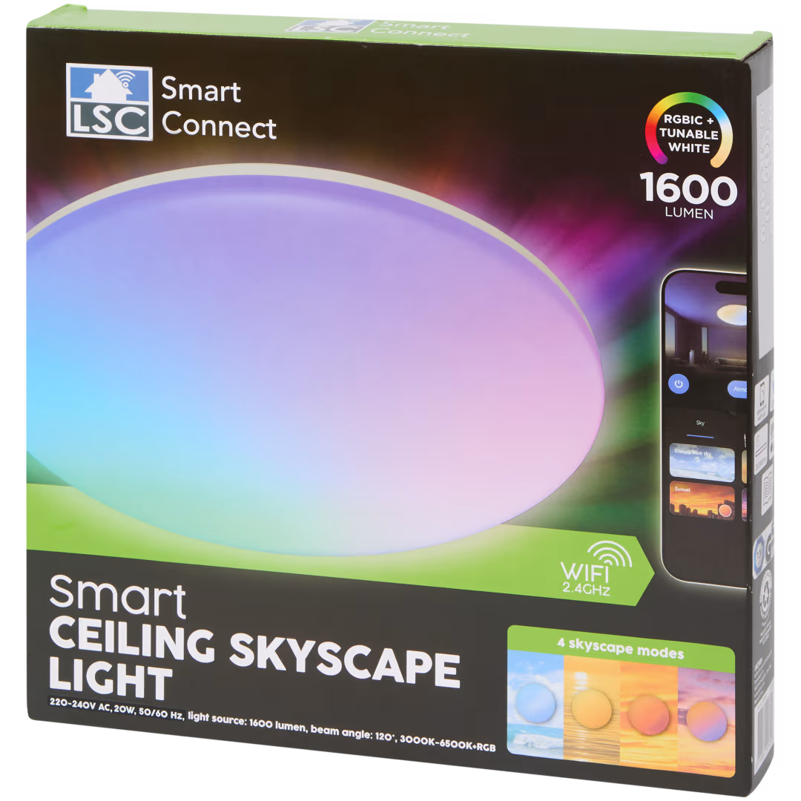

## Product Images



## Product Description

This is the LSC Smart Connect **Smart Ceiling Skyscape Light**, sold by Action. The packaging specifies:

- 20 W
- 1600 lumen
- 220-240 V AC, 50/60 Hz
- 3000-6500 K tunable white
- RGBIC
- 2.4 GHz Wi-Fi
- Four advertised Skyscape modes

The tested hardware revision contains a **BK7238** Wi-Fi module connected to a separate Tuya MCU over UART.
The module itself is marked `CBU`, which would normally suggest a BK7231N-based CBU module, but this unit was
positively identified as BK7238. Use the Tuya T1 BK7238 board definition shown below rather than assuming the SoC
from the module marking.

Hardware revisions may differ, so verify the SoC before flashing.

## UART Pinout

| BK7238 pin | Function |
| --- | --- |
| P10 | RX from Tuya MCU |
| P11 | TX to Tuya MCU |

The UART runs at 9600 baud.

## Tuya Datapoints

| DP | Type | Function |
| --- | --- | --- |
| 20 | BOOL | Master power |
| 21 | ENUM | Operating mode: `0` effect, `2` white/CCT, `3` RGB |
| 22 | VALUE | Brightness, 10-1000 |
| 23 | VALUE | Colour temperature, 0-1000 |
| 24 | STRING | RGB colour, HSV `HHHHSSSSVVVV` |
| 26 | VALUE | Off timer in seconds |
| 54 | BOOL | RGB output enable |
| 63 | BOOL | White output enable |
| 64 | RAW | Built-in effect selector |

## Built-in Effects

| Effect | DP64 |
| --- | --- |
| Sunrise | `00:01` |
| Cloudy Blue Sky | `00:03` |
| Sunset | `00:04` |
| Afterglow | `00:05` |
| Tricolor | `00:11` |
| RGB Cycle High | `00:12` |
| RGB Cycle Low | `00:14` |
| Color Shift | `00:15` |

## Flashing

The light must be **fully disassembled** to access the Wi-Fi module and its serial connections. Disconnect the light
from mains power before opening it or doing any soldering work.

Although the module is labelled `CBU`, the tested unit contains a **BK7238** SoC. Do not select a BK7231N board
definition solely from the CBU marking.

The BK7238 serial RX/TX lines are shared with the separate Tuya MCU, and the module is powered from the lamp
electronics. For reliable serial flashing, the BK7238 needs to be electrically isolated from the rest of the
controller. There are two practical approaches:

1. **Remove the Wi-Fi module from the PCB with hot air** and flash it separately.
2. Leave the module fitted, but **cut or otherwise disconnect the RX and TX lines between the BK7238 module and the
   Tuya MCU, and isolate the module VCC line**. The module can then be powered independently from the flashing
   adapter while programming.

After flashing, restore the RX, TX and VCC connections so ESPHome can communicate with the original Tuya MCU over
UART.

A full flash backup with `ltchiptool` is strongly recommended before replacing the stock firmware.

## AI-Assisted Reverse Engineering

AI assistance was a significant part of making this ESPHome configuration work. ChatGPT was used extensively during
the reverse-engineering process to interpret `ltchiptool` output and UART logs, correlate the supplied remote-control
buttons with Tuya datapoint changes, identify the light's operating modes and built-in effects, and iteratively build
and refine the ESPHome configuration.

The final datapoint mappings and behaviour documented here were validated on the physical device through repeated
flashing and functional testing.

## Configuration

```yaml file=config.yaml
```
